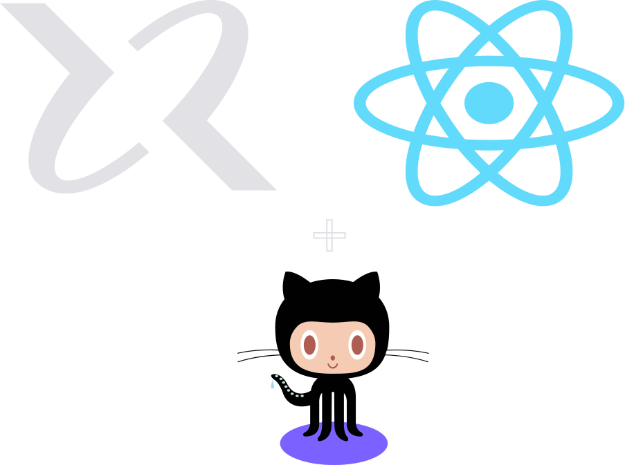

<h1 align="center">
    

<b>Formação em React</b>   
Rocketseat - Junho 2024
</h1>

Bem-vindo ao meu repositório! Aqui, registro minhas anotações e códigos de forma organizada, seguindo um formato de estudo que iniciei durante meu <a src="https://github.com/Raphael-GC/byu-codes">bacharelado</a>. Este repositório será dedicado às novidades e ao aprofundamento dos conceitos que encontro ao longo do curso, sem a intenção de cobrir todo o conteúdo do curso.
  
Diferente do meu repositório anterior, aqui meus estudos estarão divididos em dias, e não em semanas. Quero explorar o curso ao máximo e ter a liberdade de registrar os detalhes diários do meu aprendizado.   
Minha meta é concluir essa formação em um mês. O curso tem 50 horas, e acredito que essa estrutura de registros diários me ajudará a manter a motivação, permitindo-me revisar facilmente tudo o que eu vier a aprender durante essa jornada.

## Principais Tópicos:
- Fundamentos

- Aprofundando em Hooks

- HTTP e Performance

- Integrando Frontend - Backend

- Primeiro framework

- Design System

- Aprofundando em Next.js

 

### Semana 1

    
<b>Meu resumo diário </b>
 
        <a src="https://github.com/Raphael-GC/react-rocketseat/blob/main/semana_1/dia_1.md">Dia 1</a> 
        <a src="https://github.com/Raphael-GC/react-rocketseat/blob/main/semana_1/dia_2.md">Dia 2</a> 
    -  
    -  
    -  
    -   

    

    
<b>Assuntos abordados</b>
      
    -  
    -  
    -  
    -  
    -         

### Semana 2

    
<b>Meu resumo diário</b>
 
    -  
    -  
    -  
    -  
    -  
    -   

    

    
<b>Assuntos abordados</b>
      
    -  
    -  
    -  
    -  
    -         

### Semana 3

    
<b>Meu resumo diário</b>
 
    -  
    -  
    -  
    -  
    -  
    -   

    

    
<b>Assuntos abordados</b>
      
    -  
    -  
    -  
    -  
    -         

### Semana 4

    
<b>Meu resumo diário</b>
 
    -  
    -  
    -  
    -  
    -  
    -   

    

    
<b>Assuntos abordados</b>
      
    -  
    -  
    -  
    -  
    -         

 

Grow like a 🌳!
